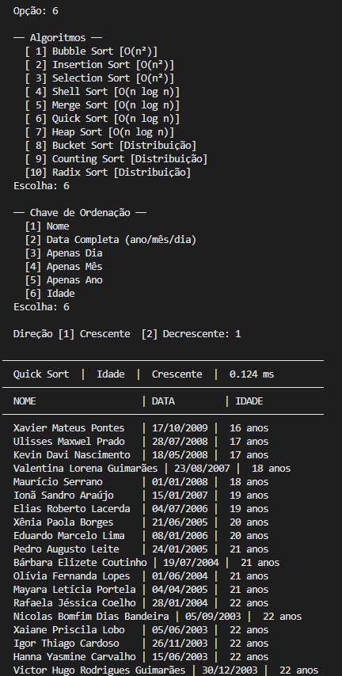

# G39_Ordenacao_EDA2-2026.1

**Número da Lista**: 39<br>
**Conteúdo da Disciplina**: Algoritmos de Ordenação<br>

## Alunos
| Matrícula | Aluno |
| --------- | -------------------------------- |
| 211062348 |  Nicolas Bomfim Dias Bandeira    |
| 211063256 |  Victor Hugo Rodrigues Guimarães |

## Sobre 

Este projeto implementa e compara diferentes algoritmos de ordenação, utilizando uma base de dados de aniversariantes. O objetivo é demonstrar a aplicação prática de algoritmos de ordenação como Bubble Sort, Insertion Sort, Selection Sort, Shell Sort, Merge Sort e Quick Sort, permitindo ordenar registros de pessoas por diversos critérios (nome, idade, data de nascimento).

## Vídeo de Apresentação


## Screenshots




## Instalação 
**Linguagem**: Python

## Pré-requisitos
- Python 3.7 ou superior
- Nenhuma biblioteca externa é necessária (utiliza apenas módulos da biblioteca padrão do Python)

## Uso 
Execute o programa com:
```bash
python main.py
```

O programa carrega a base de dados de aniversariantes do arquivo `aniversariantes.csv` e oferece opções para:
- Ordenar por nome, idade ou data de nascimento
- Escolher diferentes algoritmos de ordenação (Bubble Sort, Insertion Sort, Selection Sort, Shell Sort, Merge Sort, Quick Sort)
- Visualizar os tempos de execução para comparar a performance de cada algoritmo

## Outros 
- O arquivo `aniversariantes.csv` contém dados de pessoas com nome, dia, mês e ano de nascimento
- A idade é calculada automaticamente com base na data de referência (01/01/2026)